# Kingdom Of Games Testing File

[Back to README.md file](README.md)

## HTML / CSS

I have used the recommended [HTML W3C Validator](https://validator.w3.org/) to validate my HTML.

| Page | Screenshot | Notes |
| ---- | ---------- | ----- | 
| Screenshot | 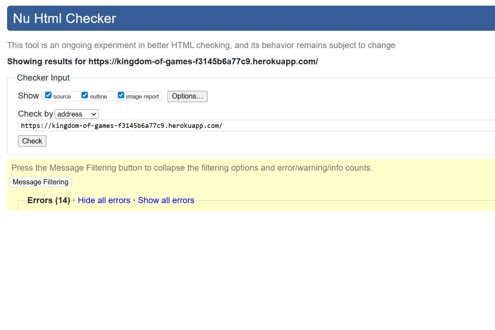 | Some errors with format, fixed some extra spcaing and indents, some errors from coding I used with Django and Code Institute |

I have used the recommended [CSS Jigsaw Validator](https://jigsaw.w3.org/css-validator/) to validate all of my CSS files.

| File | Screenshot | Notes |
| ---- | ---------- | ----- |
| CSS Screenshot |  | No errors |

## Browser Compatibility

| Page | Screenshot | Notes |
| ---- | ---------- | ----- |
| Chrome |  | No problems |
| Microsoft Edge | 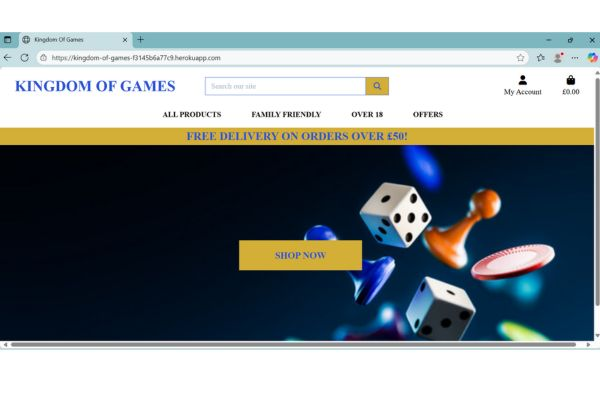 | No problems |

## Lighthouse

I've tested my deployed project using the Lighthouse tool to check for issues. Although overall the score is pretty high, I'd ideally like to be over 90 for all areas, after reading the evaluation I would need to change the colour contrast and reduce or change third party apps like Stripe, as it doesn't seem to like the payment app.

| Page | Screenshot |
| ---- | ---------- |
| Home | 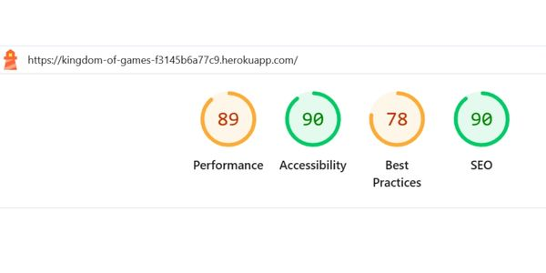 |
| Products | 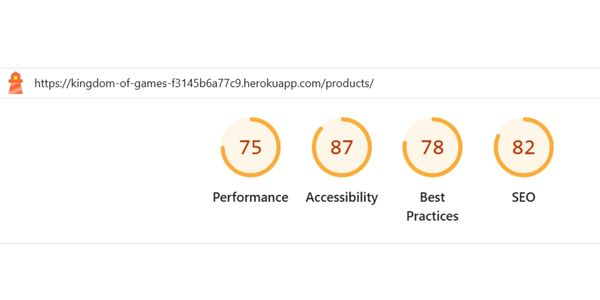 |
| Profile |  |
| Login | 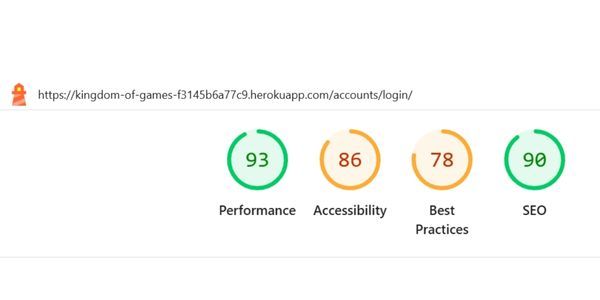 |

## Responsiveness

I've tested my deployed project on different screen sizes. I have also tried on laptop and desktop with no issues.

| Type | Screenshot | Notes |
| ---- | ---------- | ----- |
| Samsung Galaxy s8 |  | Loaded as expected |
| Pixel7 |  | Loaded as expected |
| IPhone se | 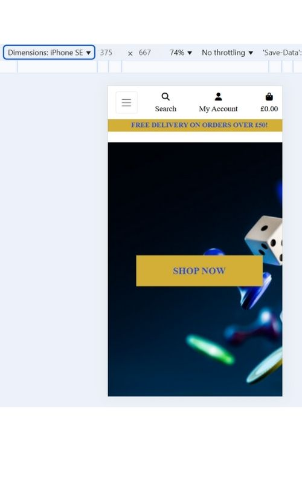 | Loaded as expected |

## Testing Features

| Type | Screenshot | Notes |
| ---- | ---------- | ----- |
| Checkout bag on surface pro 7| 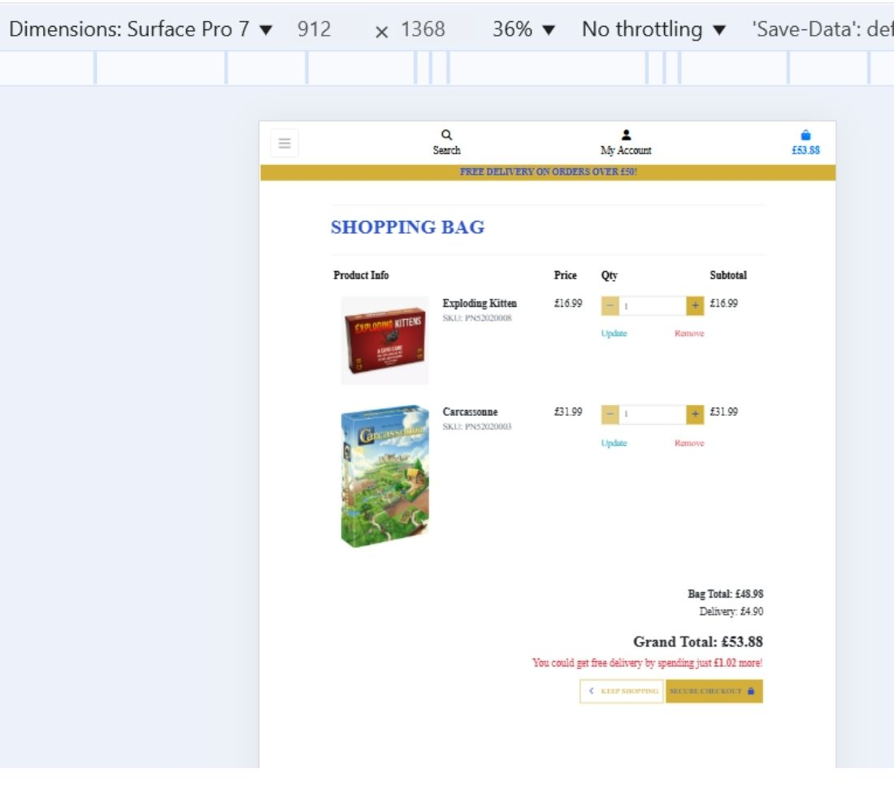 | Loaded as expected |
| Checkout bag on iphone xr| 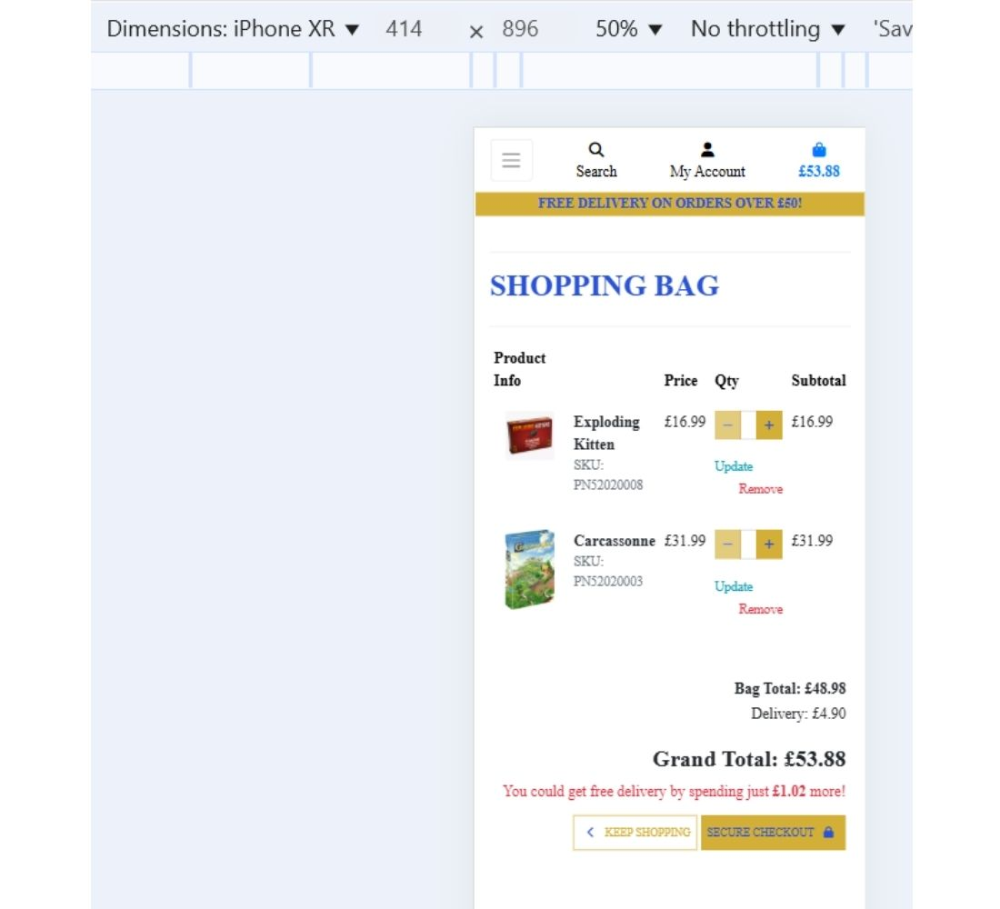 | Loaded as expected |
| When you miss a field out on the checkout page | 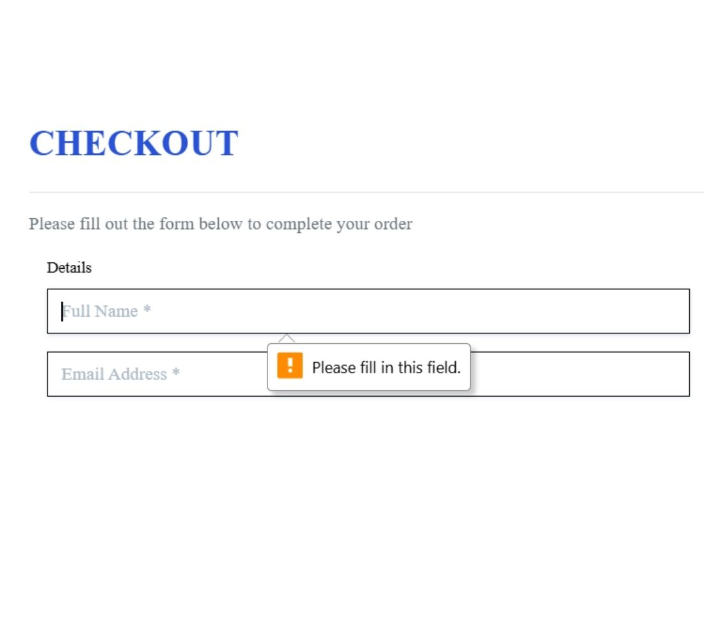 | Loaded as expected |
| Add to bage | 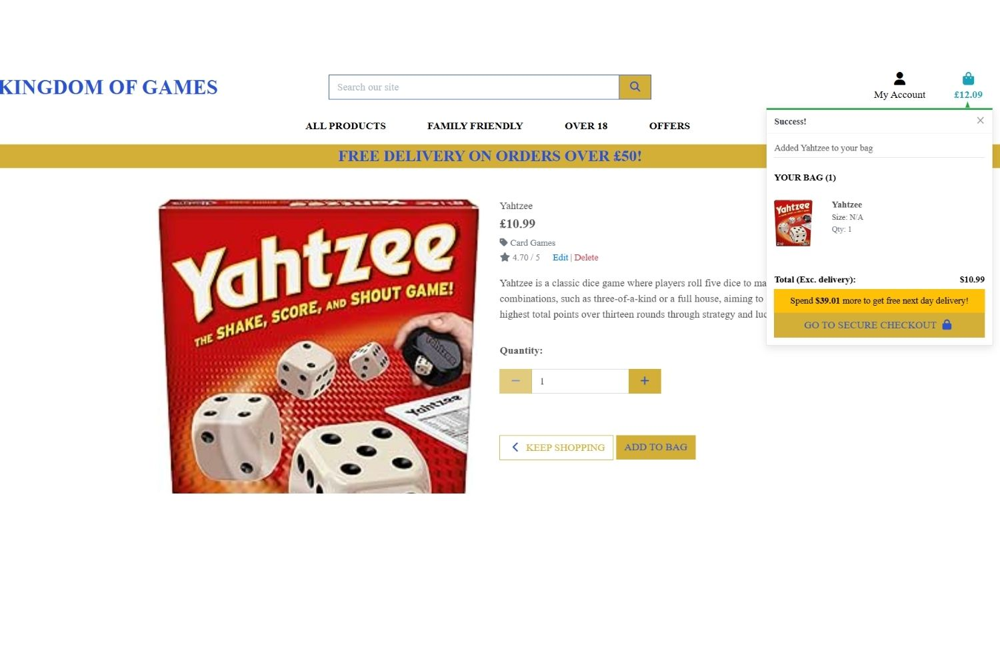 | Loaded as expected |
| Alerts when you go to edit a product | 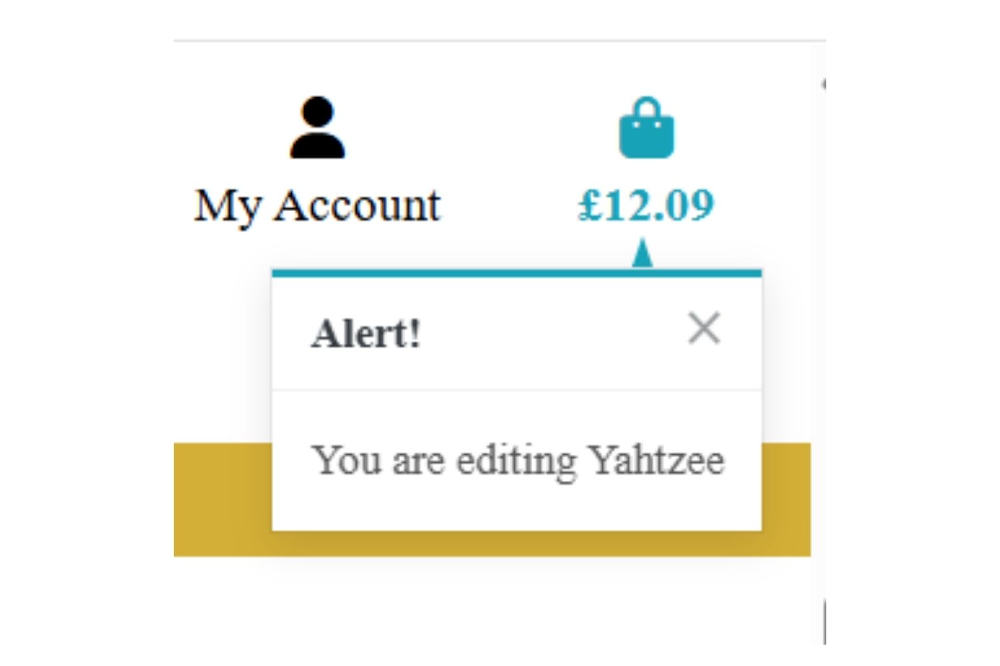 | Loaded as expected |
| Previous orders | 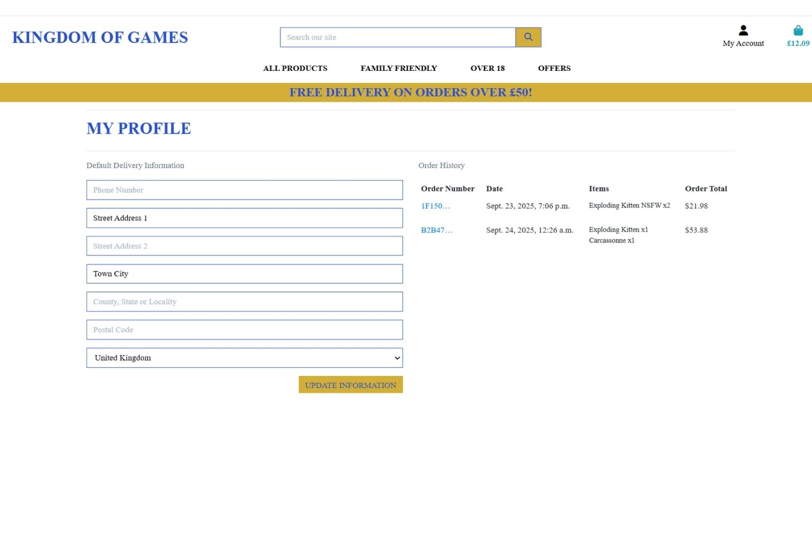 | Loaded as expected, when you place orders you can go on your profile to view your order history |
| Django admin | 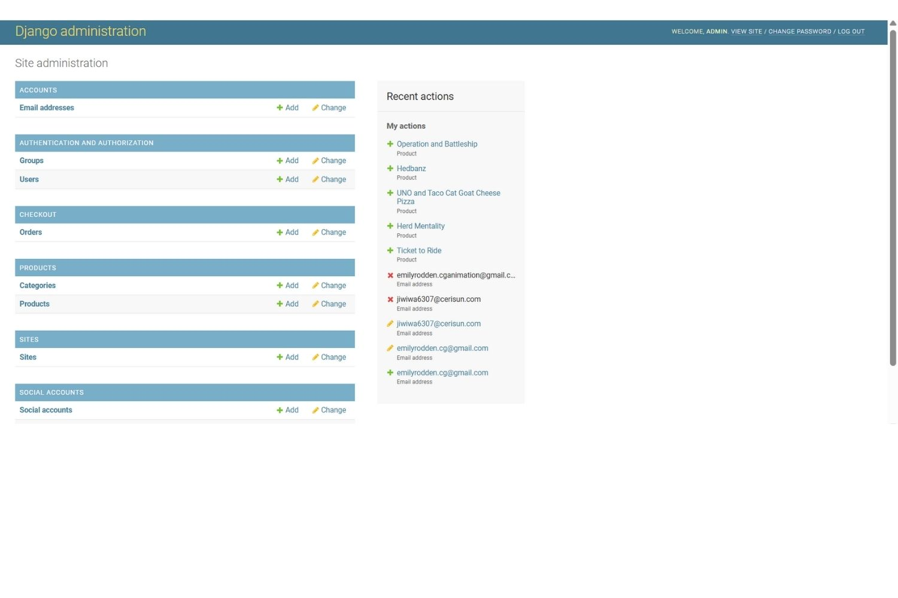 | Loaded as expected, superuser has full access to add/edit/delete products, accounts and users. I have also added products through the superuser and directly on the site. This is how I added all products on the offers pages |