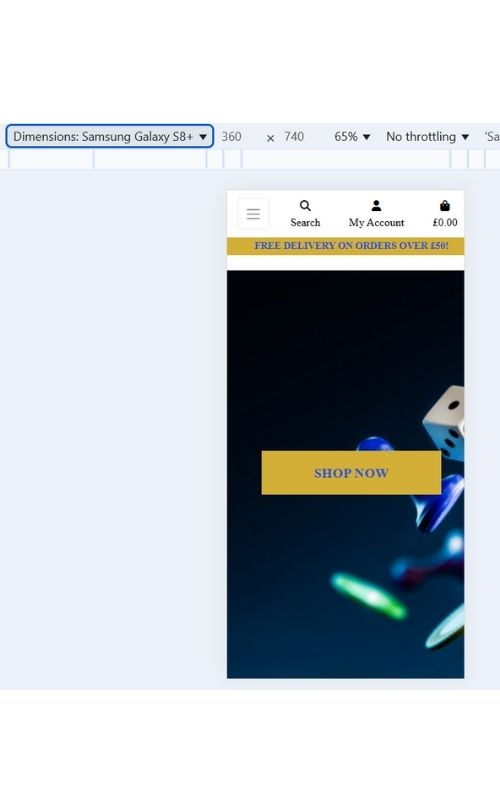
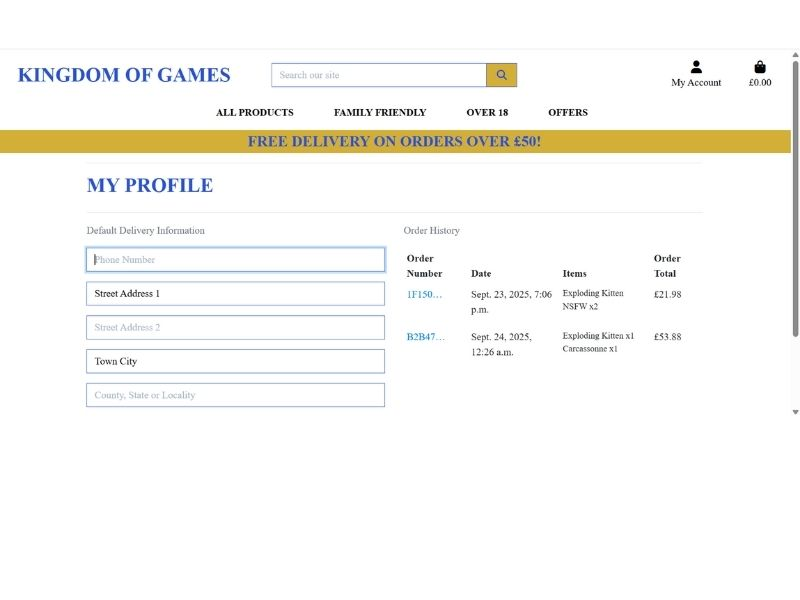
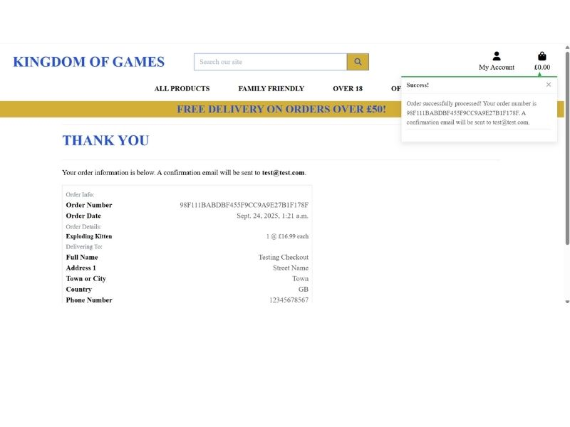

# Kingdom Of Games Testing File

[Back to README.md file](README.md)

## HTML / CSS

I have used the recommended [HTML W3C Validator](https://validator.w3.org/) to validate my HTML.

| Page | Screenshot | Notes |
| ---- | ---------- | ----- | 
| Screenshot |  | Some errors with format, fixed some extra spacing and indents, some errors from coding I used with Django and Code Institute |

I have used the recommended [CSS Jigsaw Validator](https://jigsaw.w3.org/css-validator/) to validate all of my CSS files.

| File | Screenshot | Notes |
| ---- | ---------- | ----- |
| CSS Screenshot |  | No errors |

## Browser Compatibility

| Page | Screenshot | Notes |
| ---- | ---------- | ----- |
| Chrome |  | No problems |
| Microsoft Edge |  | No problems |

## Lighthouse

I've tested my deployed project using the Lighthouse tool to check for issues. Although overall the score is pretty high, I'd ideally like to be over 90 for all areas, after reading the evaluation I would need to change the colour contrast and reduce or change third party apps like Stripe, as it doesn't seem to like the payment app.

| Page | Screenshot |
| ---- | ---------- |
| Home |  |
| Products |  |
| Profile |  |
| Login |  |

## Responsiveness

I've tested my deployed project on different screen sizes. I have also tried on laptop and desktop with no issues.

| Type | Screenshot | Notes |
| ---- | ---------- | ----- |
| Samsung Galaxy s8 |  | Loaded as expected |
| Pixel7 |  | Loaded as expected |
| IPhone se |  | Loaded as expected |

## Testing Features

| Type | Screenshot | Notes |
| ---- | ---------- | ----- |
| Checkout bag on surface pro 7|  | Loaded as expected, it all fits on the screen with enough border around the edges. Doesn't break the layout. |
| Checkout bag on iphone xr|  | Loaded as expected, it all fits on the screen with enough border around the edges. Doesn't break the layout.|
| When you miss a field out on the checkout page |  | Loaded as expected, comes up with an error to tell the user they need to fill out the field.  |
| Add to bag |  | Loaded as expected, a pop up in the top right appears to tell the user the item has been added to the bag, it shows the item and cost and total cost below. |
| Alerts when you go to edit a product |  | Loaded as expected, a pop up appears to tell the user an item is being edited. |
| Previous orders |  | Loaded as expected, when you place orders you can go on your profile to view your order history |
| Django admin |  | Loaded as expected, superuser has full access to add/edit/delete products, accounts and users. I have also added products through the superuser and directly on the site. This is how I added all products on the offers pages |
| Testing order |  | Loaded as expected, a loading arrow came oon while it was processing the order and then a popup in the top right to show if it has been successful. Order information is all correct and stores on the users profile. If order was unsuccessfull, an error comes up in the top right. |
| Local Email confirmation |    | On the local network I tested register an account feature which sends a confirmation email to activate the account. All worked as expected. |
| Delivery costing |   | Loaded as expected, when the user spends under £50 a message appears at checkout to notify the user if they spend over £50 they get free delievery. It also shows them how much more they need to spend to get it. Once they spend voer £50 this message disappears and the delievery amount is £0.00 |
| 3 Game Bundle |  | Loaded a expected, when 3 or more games have been added to the bag, when the user goes to the checkout a 5% discount is added. |
| Gift Card |    | Loaded a expected, when a giftcard code has been entered a pop up apepars in the top left saying its been added and how much for, then when the user goes to checkout it shows the discount has been applied. |
| Leaving a review |   | Loaded a expected, when the user isn't signed in, it shows you can leave a review but only if you sign in, a link is provided to take the user to sign in. Once signed in the page allows you to right a review on any of the product pages. Once submitted it appears on the screen for anyone to see, the user or admin has the option to delete this review at any time. |