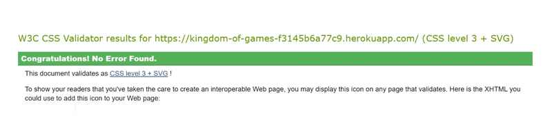

# Kingdom Of Games Testing File

[Back to README.md file](README.md)

## HTML / CSS

I have used the recommended [HTML W3C Validator](https://validator.w3.org/) to validate all of my HTML files.

| Page | Screenshot | Notes |
| ---- | ---------- | ----- | 
| Screenshot 1 |  | N/A |
|  |  | N/A |
| |  | N/A |

I have used the recommended [CSS Jigsaw Validator](https://jigsaw.w3.org/css-validator/) to validate all of my CSS files.

| File | Screenshot | Notes |
| ---- | ---------- | ----- |
| CSS Screenshot |  | No errors |

## Browser Compatibility

| Page | Screenshot | Notes |
| ---- | ---------- | ----- |
| Chrome |  | No problems |
| Microsoft Edge |  | No problems |

## Lighthouse

I've tested my deployed project using the Lighthouse tool to check for issues. Although overall the score is pretty high, I'd ideally like to be over 90 for all areas, after reading the evaluation I would need to change the colour contrast and reduce or change third party apps like Stripe, as it doesn't seem to like the payment app.

| Page | Screenshot |
| ---- | ---------- |
| Home |  |
| Products |  |
| Profile |  |
| Login |  |

## Responsiveness

I've tested my deployed project on different screen sizes. I have also tried on laptop and desktop with no issues.

| Type | Screenshot | Notes |
| ---- | ---------- | ----- |
| Samsung Galaxy s8 |  | Loaded as expected |
| Pixel7 |  | Loaded as expected |
| IPhone se |  | Loaded as expected |